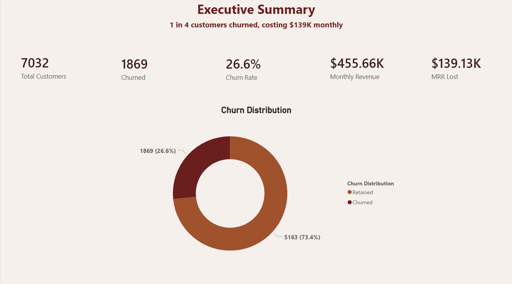
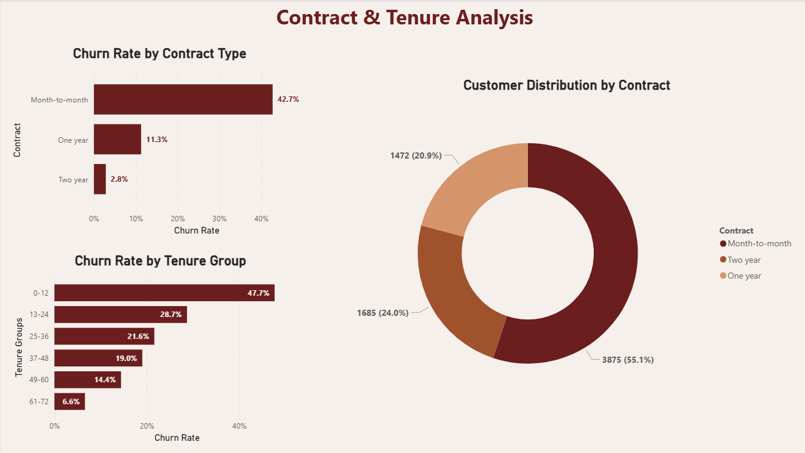
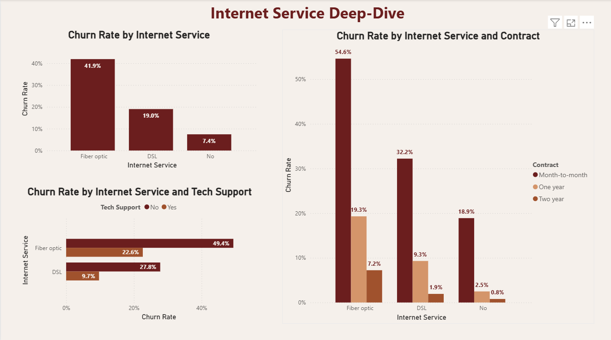
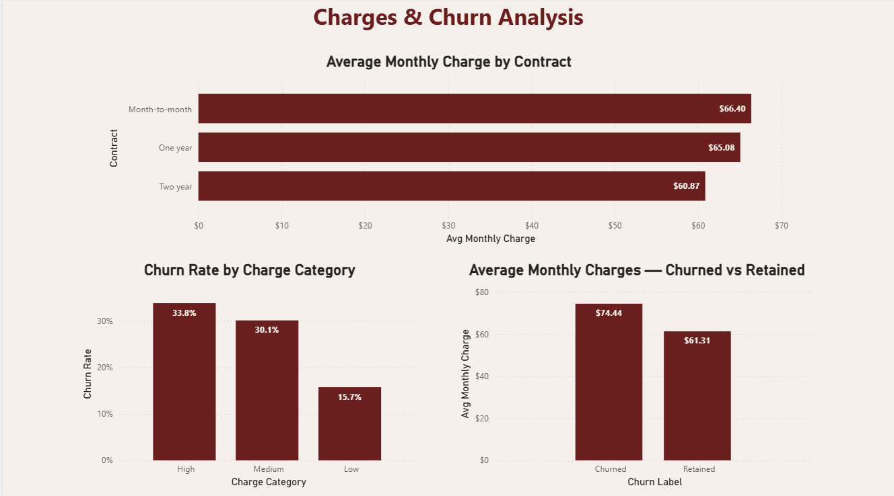
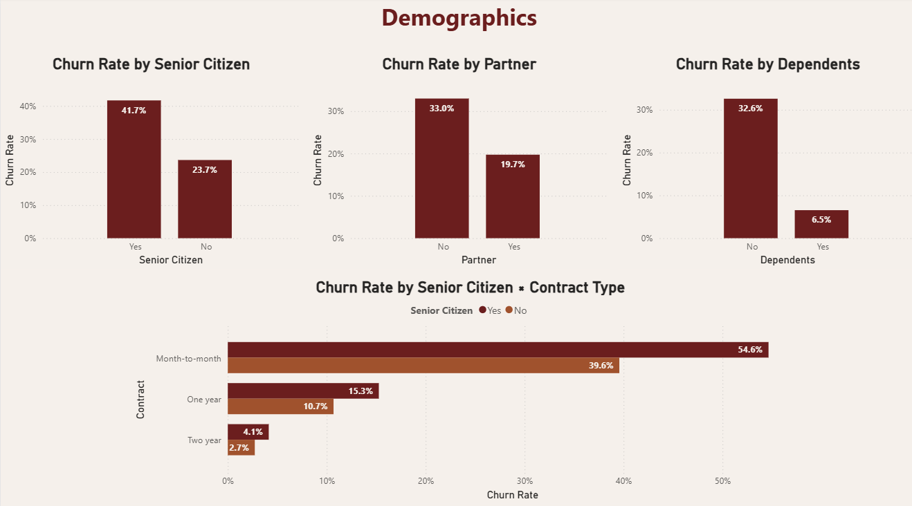
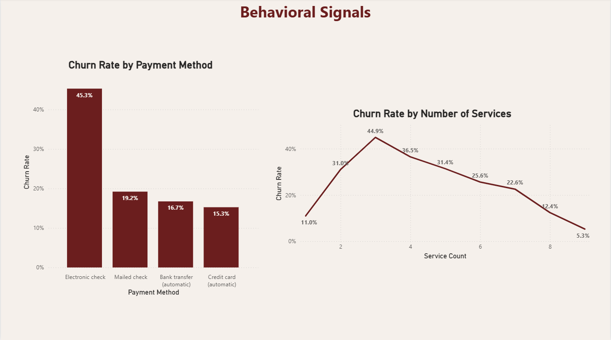
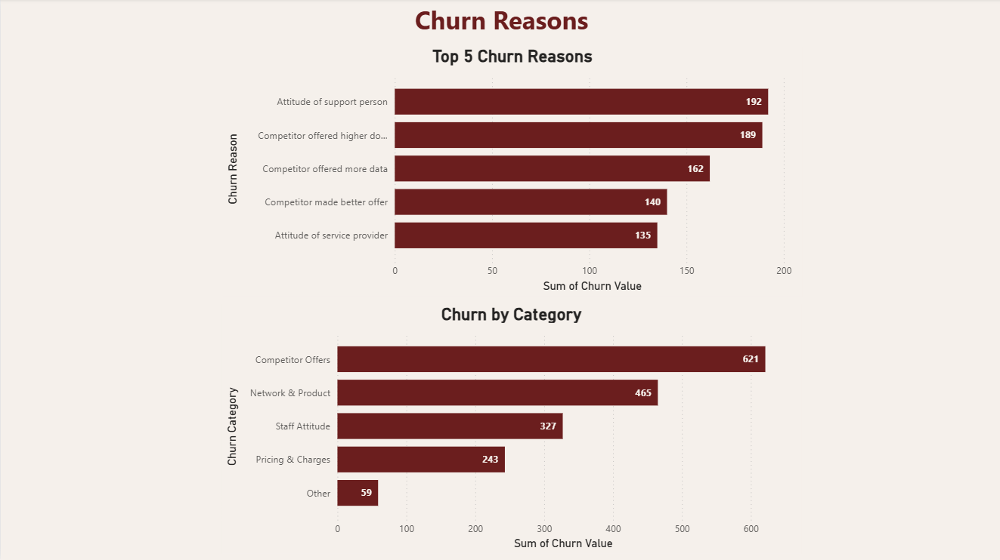

# Telco Customer Churn Analysis

An end-to-end data analysis project identifying the key drivers of customer churn in a telecom business, using Python, MySQL and Power BI.

---

## Project Overview

**Dataset:** [IBM Telco Customer Churn](https://www.kaggle.com/datasets/yeanzc/telco-customer-churn-ibm-dataset)

**Overall churn rate:** 26.6% (1,869 customers)  

**Lost MRR to churn:** ~$139K/month

This project follows a full analytics workflow: raw data cleaning → SQL-based business queries → exploratory data analysis → an interactive Power BI dashboard.

---

## Key Findings

- Month-to-month customers churn at 42.7% — nearly 15x the rate of two-year contract holders (2.8%)
- 47.7% of customers churn within their first 12 months; by year six that drops to 6.6%
- Fiber optic customers churn at 41.9% — more than double the DSL rate (19%) and tech support roughly halves churn across both service types
- The highest-risk segment: Fiber optic + Month-to-month customers churn at 54.6% while generating $4.19M in total dataset revenue
- Competitors are the #1 stated reason for leaving (36.2%) while price ranks 9th at 5.7% — the problem is product competitiveness, not pricing.

---

## Business Recommendations

**1. Make contract conversion the primary retention lever — with a dedicated senior track.**
The 15x churn gap between month-to-month and two-year contracts makes this the highest-ROI single action available. A targeted discount or loyalty incentive for contract upgrades — specifically within the first 12 months — addresses both the contract type and tenure risk window in one move. For senior citizens (54.65% churn on month-to-month), channel matters: phone-based outreach and simplified options, not app notifications.

**2. Fix the first year or lose the customer permanently.**
47.7% of year-one customers churn. Structured check-ins, proactive support, and early engagement incentives between months 1–6 address the maximum-risk window before it becomes a loss.

**3. Treat staff attitude as a standalone retention problem.**
At 11.2%, staff attitude is the single largest individual churn reason — fully within the company's control. Frontline training and accountability mechanisms should be treated as a direct retention investment, not a service improvement exercise.

**4. Bundle tech support into fiber onboarding. Nudge electronic check users to auto-pay.**
Fiber customers without tech support face a near-50% churn risk — including tech support in a fiber welcome bundle could halve churn in that cohort. Separately, nudging electronic check users (45.3% churn) toward auto-pay (16% churn) is low-cost with a clear, measurable impact.

**5. Build a competitive response on product, not just process.**
Competitors account for 36.2% of stated churn reasons. Fixing internal processes alone won't stop customers being pulled away by better speeds and stronger offers. A product and pricing review against key competitors is necessary.

---

## Dashboard

The Power BI dashboard covers 7 pages:

| Page | What it shows |
|------|--------------|
| Executive Summary | Overall churn rate (26.6%), MRR lost ($139K), churn distribution |
| Contract & Tenure | Churn by contract type and tenure band; customer distribution across contract types |
| Internet Service Deep-Dive | Fiber vs DSL churn; impact of tech support; contract × service type cross-analysis |
| Charges & Churn | Monthly charge by contract type; churn rate by charge category; churned vs retained avg charges |
| Demographics | Churn by senior citizen status, partner, dependents; senior × contract type breakdown |
| Behavioral Signals | Churn by payment method; churn rate by number of services subscribed |
| Churn Reasons | Top 5 individual churn reasons; churn grouped by category (competitor, staff, product, pricing) |

### Screenshots

**Executive Summary**


**Contract & Tenure Analysis**


**Internet Service Deep-Dive**


**Charges & Churn**


**Demographics**


**Behavioral Signals**


**Churn Reasons**


---

## Repository Structure

```
├── data/
│   ├── Telco_customer_churn.xlsx       # Raw dataset
│   └── telco_churn_cleaned.csv         # Cleaned dataset
│
├── notebooks/
│   ├── 01_Cleaning.ipynb               # Data cleaning & preprocessing
│   └── 02_EDA.ipynb                    # Exploratory data analysis
│
├── sql/
│   └── *.sql                           # 16 business queries
│
├── dashboard/
│   └── visualization.pbix              # Power BI dashboard
│   └── screenshots/                    # Dashboard page screenshots
│
└── README.md
```

---

## Tools Used

- Python (pandas, matplotlib, seaborn) — data cleaning & EDA
- MySQL — business queries & segmentation  
- Power BI — interactive dashboard
- Google Colab — notebook environment
